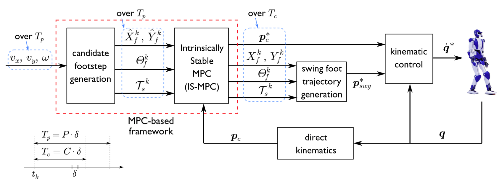

# Intrinsically stable MPC



## Installation

### Python Binding

To use also the python bindings, you need to call the setup.py script. The `pixi.toml` file will do that for you. Just run
```
pixi install
pixi run build
pixi run install
```

## Run

To run the code:
```
pixi run main
```

## Some Concepts

### Footstep Planner

To generate the candidate footstep poses, we use a reference trajectory obtained
by integrating a template model under the action of the high-level reference
velocities. After that, we solve two QP problems to find the poses. The template
model is an omnidirectional motion model which allows the template robot to move
along any Cartesian path with any orientation, so as to perform, e.g., lateral
walks, diagonal walks, and so on. A single step has duration $T$.

#### Breakdown of Time Phases Within $T$:

1. **Double Support Phase:**
   - **Duration:** Since double support occupies 25% of the entire duration $T$, the duration of the double support phase is $0.25T$.
   - **Timing:**
     - The first double support phase starts at $t = 0$ and ends at $t = 0.25T$.
     - The second double support phase starts at $t = T$ and lasts for another $0.25T$, but this is technically the start of the next cycle (assuming the framework is periodic).

2. **Single Support Phase:**
   - **Duration:** The single support phase occupies the remaining 75% of the duration $T$.
   - **Timing:**
     - It begins right after the first double support phase ends, so it starts at $t = 0.25T$ and ends at $t = T$.
     - During this time, only one foot is in contact with the ground.

#### Formal Representation of the Gait Cycle:

Given that $T$ is the time between two consecutive foot placements and the double support phase takes 25% of this duration, the timeline can be formalized as follows:

1. **First Double Support Phase:**
   $t \in [0, 0.25T]$
   - Both feet are on the ground, starting with foot $j$ (right) being placed down.

2. **Single Support Phase:**
   $t \in (0.25T, T]$
   - The left foot (foot $j+1$) is in the air, and the entire body weight is supported by the right foot (foot $j$).

3. **Second Double Support Phase:**
   - The next double support phase would start at $t = T$ in the next cycle.

#### Visualization:

To summarize the temporal distribution within $T$:

- **Double Support 1:** $t \in [0, 0.25T]$
- **Single Support:** $t \in (0.25T, T]$
- **Next Double Support 2:** Starts at $t = T$ (for the next cycle)

This division ensures that each step (transition from foot $j$ to foot $j+1$) is smoothly handled with a brief period of increased stability (double support) followed by a longer period of single support, where dynamic balance is critical.

#### Input-Output:

- **Input**
  - Current time $t_k$
  - WalkState, containing information on support foot, walk phase and timestamp about the last footstep

- **Output**
  - F planned footsteps over the planning horizon P with associated timestamps and proposed poses
  - Mapping (dim C) from $i$ (goes from 0 to C) to $j$ (goes from 0 to F)
  - Poses (dim C) for every timestep inside control horizon with linear interpolation in single support phase
